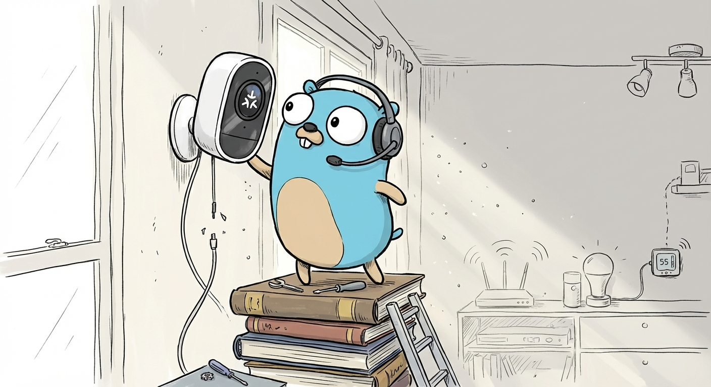

<h1 align="center">
  
   
  Matter
   
</h1>
<h4 align="center">A pure Go implementation of the Matter protocol</h4>

  

 

### Features

- Matter 1.5 Specification
  - TLV encoding/decoding
  - Secure Channel (PASE, CASE)
  - Interaction Model
  - Pluggable Device Attestation
- WebRTC Transport Cluster
- Pure Go, no Cgo

### Roadmap

- [ ] Complete OnOff chip-tool integration test
  - [ ] clusters/operationalcredentials
- [ ] Improve clusters/webrtc-transport
  - [ ] 10.2.3 Chunking
- [ ] clusters/cameras
- [ ] Improve examples
- [ ] Improved mDNS support

### License

MIT License - see [LICENSE](LICENSE) for full text
